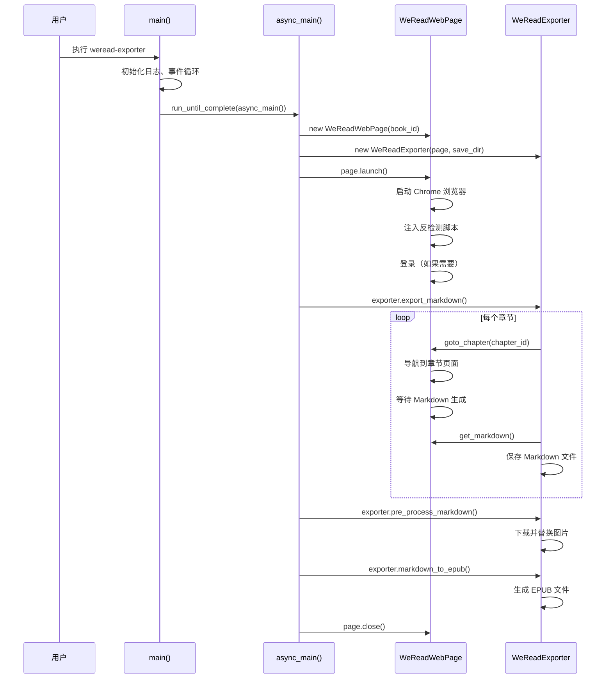

# 项目结构与代码概览

> 本文档是开发路径的第一篇，面向希望理解 weread-exporter 内部实现的开发者。通过阅读本文档，你将全面了解项目的目录结构、各模块的职责划分、核心类的设计，以及程序的执行流程。这些知识是后续深入学习各模块实现的基础。

## 学习目标

完成本章节学习后，你将能够独立阅读项目源码，理解各模块之间的协作关系，并能够定位特定功能对应的代码位置。此外，你还将掌握项目的构建流程、运行方式，以及如何从源码级别进行调试。这些能力对于后续进行二次开发和问题排查至关重要。

### 基础目标

首先，你将掌握 weread-exporter 的项目结构，包括目录组织、关键文件的位置和作用。其次，你将理解四层架构设计（CLI 层、业务层、浏览器层、工具层）以及每层的职责。第三，你将能够追踪从命令行执行到最终文件输出的完整调用链。第四，你将学会如何从源码运行和调试项目。

### 进阶目标

进阶目标要求你能够设计新功能的模块划分，理解代码的组织原则和设计取舍。你还将具备评估代码修改影响范围的能力，能够在修改一处代码时预判可能影响的其他部分。这些能力对于参与项目贡献和进行深度定制非常重要。

## 1.1 项目整体结构

weread-exporter 采用清晰的分层架构设计，将不同职责的代码分离到不同的模块中。这种设计遵循了单一职责原则，使得各层可以独立演进和测试。本节将详细介绍项目的目录结构和文件组织方式。

### 1.1.1 根目录结构

项目的根目录包含了所有核心文件和配置文件。以下是主要文件和目录的功能说明：

```
weread-exporter/
├── weread_exporter/          # 核心包，包含所有业务逻辑
│   ├── __init__.py
│   ├── __main__.py          # CLI 入口点
│   ├── export.py            # 导出工作流实现
│   ├── webpage.py           # 浏览器自动化核心
│   ├── utils.py             # 工具函数集合
│   ├── hook.js              # Canvas Hook 注入脚本
│   ├── style.css            # PDF 样式
│   ├── epub.css             # EPUB 样式
│   └── bin/                 # 平台二进制文件
│       ├── linux/
│       └── win32/
├── scripts/                 # 构建和实用脚本
├── tests/                   # 测试套件
├── docs/                    # 项目文档
├── cache/                   # 运行时缓存目录
├── output/                 # 输出文件目录
├── pyproject.toml          # PEP 517 构建配置
├── setup.py                # 传统 setuptools 配置
├── requirements.txt        # 运行时依赖
└── CLAUDE.md              # Claude Code 指导文件
```

理解根目录结构有助于快速定位所需文件。例如，如果你需要修改 CLI 参数处理逻辑，应该查看 `__main__.py`；如果需要修改导出格式转换逻辑，应该查看 `export.py`；如果需要了解浏览器如何与网站交互，应该查看 `webpage.py`。

### 1.1.2 核心包结构

`weread_exporter/` 目录是整个项目的核心，包含了所有的业务逻辑代码。这个包的设计遵循了清晰的层次结构，每个模块都有明确的职责边界。

核心包的模块划分遵循功能相关性原则。CLI 相关的代码集中在 `__main__.py` 中，导出流程相关的代码在 `export.py` 中，浏览器自动化相关的代码在 `webpage.py` 中，通用工具函数在 `utils.py` 中。这种划分使得每个模块都保持相对独立，便于理解和维护。

```python
# weread_exporter/__init__.py
"""
weread-exporter - 微信读书导出工具

支持将微信读书内容导出为 EPUB、PDF、MOBI、TXT、Markdown 格式。
使用 Canvas Hook 技术突破内容保护，通过 Pyppeteer 实现浏览器自动化。
"""

VERSION = "1.0.0"
```

包的初始化文件声明了版本信息，提供了包级别的元数据。这种简洁的初始化方式避免了复杂的导入逻辑，保持了模块的独立性。

### 1.1.3 资源文件

除了 Python 代码，项目还包含了多种资源文件，这些文件对于正确运行工具同样重要。

`hook.js` 是 Canvas Hook 注入脚本，用于拦截 Canvas 渲染过程并提取原始内容。这个脚本会在页面加载时注入，拦截所有对 Canvas 绘制方法的调用，记录绘制内容的数据。

`style.css` 和 `epub.css` 是两种导出格式的样式表文件。这些 CSS 文件定义了导出文件的视觉呈现，包括字体、字号、边距、代码块样式等。PDF 和 EPUB 使用不同的样式文件，以适应各自的技术特性和阅读场景。

`bin/` 目录包含平台特定的二进制文件，主要是 kindlegen 工具。这个工具用于将 EPUB 格式转换为 MOBI 格式。由于不同平台的二进制文件不同，项目分别提供了 Linux 和 Windows 版本的 kindlegen。

## 1.2 四层架构设计

weread-exporter 采用四层架构设计，从上到下依次是 CLI 层、业务层、浏览器层和工具层。这种分层设计将不同抽象级别的代码分离，使得每层可以独立变化而不影响其他层。本节将详细介绍每层的职责、核心类，以及层与层之间的交互方式。

### 1.2.1 CLI 层详解

CLI 层是整个程序的入口点，负责命令行参数解析和任务调度。这一层将用户输入转换为程序内部的执行流程，是用户与系统交互的接口。CLI 层的代码集中在 `__main__.py` 文件中，入口函数是 `main()`。

```python
# weread_exporter/__main__.py

def main():
    """程序入口函数"""
    # 平台特定初始化
    if sys.platform == "win32":
        patch_windows()
    
    # 修补 Pyppeteer 的请求生成逻辑
    patch_generateRequestHash()
    
    # 配置日志
    logging.root.level = logging.INFO
    handler = logging.StreamHandler()
    fmt = "[%(asctime)s][%(levelname)s]%(message)s"
    formatter = logging.Formatter(fmt)
    handler.setFormatter(formatter)
    logging.root.addHandler(handler)
    
    # 创建事件循环并执行主逻辑
    loop = asyncio.new_event_loop()
    asyncio.set_event_loop(loop)
    try:
        loop.run_until_complete(async_main())
    except Exception as e:
        logging.error("Fatal error in main program: %s" % str(e))
        return 1
```

CLI 层的设计有几个值得注意的细节。首先是平台特定的初始化代码，Windows 系统需要额外的 DLL 路径配置，这部分逻辑在 `patch_windows()` 函数中处理。其次是日志系统的配置，工具使用标准的 Python logging 模块，并设置了统一的输出格式。第三是异步事件循环的创建和管理，这是整个程序异步执行的基础。

参数解析逻辑位于 `async_main()` 函数中，使用 argparse 库处理命令行参数：

```python
parser = argparse.ArgumentParser(
    prog="weread-exporter", 
    description="WeRead book export cmdline tool"
)
parser.add_argument("-b", "--book-id", help="book id")
parser.add_argument("-o", "--output-format", help="output file format",
                    action="append", 
                    choices=["md", "epub", "pdf", "mobi", "txt"])
parser.add_argument("--load-timeout", help="load chapter page timeout",
                    type=int, default=60)
parser.add_argument("--load-interval", help="load chapter page interval time",
                    type=int, default=30)
# ... 更多参数
```

参数设计的灵活性体现在几个方面。`-o` 参数可以多次使用以指定多种输出格式，这是通过 `action="append"` 实现的。参数提供了合理的默认值，大多数情况下用户无需指定额外参数。参数之间存在逻辑依赖关系，例如 `--list-booklists` 不需要 `--book-id`，而导出操作需要 `--book-id`。

### 1.2.2 业务层详解

业务层是 weread-exporter 的核心引擎，负责协调各个组件完成导出任务。这一层的代码在 `export.py` 文件中，核心类是 `WeReadExporter`。业务层接收来自 CLI 层的指令，调用浏览器层获取内容，调用工具层进行格式转换，最终生成用户需要的输出文件。

```python
class WeReadExporter(object):
    """书籍导出器类"""
    
    def __init__(self, page, save_dir):
        self._page = page  # 浏览器页面对象
        self._save_dir = save_dir  # 保存目录
        self._meta_data = {}  # 书籍元数据缓存
        self._current_chapter = 0  # 当前章节索引
        
        # 创建必要的目录
        if not os.path.isdir(save_dir):
            os.makedirs(save_dir)
        # ... 更多初始化
```

`WeReadExporter` 类的设计体现了依赖注入的思想。它接收一个 `page` 对象作为参数，这个对象来自浏览器层，封装了与浏览器交互的所有方法。这种设计使得业务层与浏览器层解耦，便于测试和替换不同的浏览器实现。

业务层的核心方法是 `export_markdown()`，它负责从浏览器获取所有章节的内容：

```python
async def export_markdown(self, timeout=60, interval=30):
    """导出所有章节为 Markdown"""
    if not os.path.isdir(self._chapter_dir):
        os.makedirs(self._chapter_dir)
    
    meta_data = await self._load_meta_data()
    
    for index, chapter in enumerate(meta_data["chapters"]):
        file_path = self._make_chapter_path(index, chapter["id"])
        
        # 如果已存在且非空，跳过
        if os.path.isfile(file_path) and os.path.getsize(file_path) > 3:
            continue
        
        # 加载章节（最多重试 3 次）
        for attempt in range(3):
            try:
                await asyncio.wait_for(
                    self._page.goto_chapter(chapter["id"], timeout=timeout),
                    timeout=timeout + 60
                )
                break
            except Exception as e:
                if attempt == 2:
                    raise utils.LoadChapterFailedError()
        
        # 获取 Markdown 内容
        markdown = await self._page.get_markdown()
        
        # 保存文件
        with open(file_path, "wb") as fp:
            fp.write(markdown.encode("utf-8"))
        
        # 等待间隔
        await asyncio.sleep(interval)
```

这个方法展示了业务层处理错误和重试的策略。对于章节加载失败，工具会进行最多三次重试，每次重试前会关闭并重新启动浏览器。如果三次重试都失败，会抛出 `LoadChapterFailedError` 异常。

### 1.2.3 浏览器层详解

浏览器层负责与 Chrome 浏览器交互，包括启动浏览器、导航页面、执行 JavaScript 等。这一层的代码在 `webpage.py` 文件中，核心类是 `WeReadWebPage`。浏览器层是 weread-exporter 能够获取微信读书内容的关键，它封装了所有与 Pyppeteer 库的交互逻辑。

```python
class WeReadWebPage(object):
    """浏览器页面管理类"""
    
    root_url = "https://weread.qq.com"
    window_size = (1920, 1080)
    
    def __init__(self, book_id, cookie_path=None, webcache_path=None):
        self._book_id = book_id
        self._cookie_path = cookie_path
        self._cookie = {}
        self._webcache_path = webcache_path or "cache"
        # ... 更多初始化
```

`WeReadWebPage` 类的设计考虑了多个方面。首先是 cookie 管理，类在初始化时会加载保存的 cookie，并在登录后更新 cookie。其次是缓存管理，类维护了一个 webcache 目录，用于缓存下载的资源文件。第三是 URL 管理，类根据书籍 ID 构建各种 URL，包括书籍详情页和章节阅读页。

浏览器启动流程包含多个步骤：

```python
async def launch(self, headless=False, force_login=False,
                 use_default_profile=False, mock_user_agent=False,
                 proxy_server=None):
    """启动 Chrome 浏览器"""
    # 1. 检查 Chrome 是否安装
    chrome = self._check_chrome()
    
    # 2. 构建 Chrome 启动参数
    args = ["--no-first-run", "--remote-allow-origins=*"]
    if headless:
        args.append("--headless")
    # ... 更多参数配置
    
    # 3. 启动浏览器实例
    self._browser = await pyppeteer.launch(
        executablePath=chrome,
        ignoreDefaultArgs=True,
        args=args
    )
    
    # 4. 创建页面并注入反检测脚本
    self._page = (await self._browser.pages())[0]
    await self._page.evaluateOnNewDocument(ANTI_DETECTION_SCRIPT)
    
    # 5. 如果有 cookie，进行注入
    if self._cookie:
        await self._inject_cookie()
    
    # 6. 导航到书籍页面
    await self._page.goto(self._home_url)
    
    # 7. 处理登录（如果需要）
    if force_login or not self._cookie:
        await self.login()
```

反检测脚本的注入是浏览器层的关键步骤。微信读书可能会检测自动化访问并采取限制措施，因此需要伪装浏览器环境。反检测脚本会修改 `navigator.webdriver`、`navigator.plugins`、`navigator.languages` 等属性，使其看起来像正常用户使用的浏览器。

### 1.2.4 工具层详解

工具层提供了各种通用功能的实现，包括 HTTP 请求、书单解析、哈希计算、文件处理等。这一层的代码在 `utils.py` 文件中，包含多个独立的函数和几个自定义异常类。

```python
# weread_exporter/utils.py

class ChromeNotInstalledError(Exception):
    """Chrome 未安装异常"""
    pass

class LoginRequiredError(RuntimeError):
    """需要登录异常"""
    pass

class LoadChapterFailedError(RuntimeError):
    """加载章节失败异常"""
    pass

class InvalidUserError(RuntimeError):
    """无效用户异常"""
    pass
```

工具层的异常设计体现了清晰的错误分类。每种异常都有明确的含义，便于调用者进行针对性的处理。例如，`LoginRequiredError` 表示需要先登录才能继续操作，`LoadChapterFailedError` 表示章节加载失败，可能需要重试。

HTTP 请求函数是工具层最常用的功能之一：

```python
async def fetch(url: str, method: str = "GET", headers: Any = None,
                data: Any = None, respond_with_headers: bool = False):
    """发送 HTTP 请求，带重试机制"""
    request_headers = headers or {}
    request_headers.pop("sec-ch-ua", None)
    request_headers.pop("sec-ch-ua-platform", None)
    
    async with aiohttp.ClientSession() as session:
        for attempt in range(3):
            try:
                async with session.get(url, headers=request_headers) as response:
                    result = await response.read()
                    if respond_with_headers:
                        return response.status, response.headers, result
                    return result
            except (aiohttp.ClientError, asyncio.TimeoutError, RuntimeError) as e:
                logging.warning("Failed to fetch URL %s (attempt %d/3): %s" 
                              % (url, attempt + 1, str(e)))
                if attempt == 2:
                    raise RuntimeError(f"Fetch url {url} failed after 3 attempts")
```

这个函数实现了带重试的 HTTP 请求，使用 aiohttp 库进行异步 HTTP 通信。重试机制提高了在网络不稳定时的成功率。

## 1.3 核心类关系图

理解核心类之间的关系是把握整体架构的关键。本节将通过类关系图和交互序列图，详细说明各个类的职责和它们如何协作。

### 1.3.1 类概览

weread-exporter 项目中有两个核心类，它们分别位于不同的模块中：

`WeReadExporter` 类（export.py）负责导出流程的编排，它不知道浏览器如何工作的细节，只通过 `page` 对象进行交互。这个类的方法对应了导出的各个步骤：获取元数据、导出 Markdown、预处理、格式转换。

`WeReadWebPage` 类（webpage.py）负责与 Chrome 浏览器交互，它封装了所有浏览器操作。这个类提供了获取书籍信息、导航到章节、提取 Markdown 内容等功能。

这两个类的设计遵循了依赖倒置原则：高层模块（业务层）不依赖低层模块（浏览器层），而是都依赖于抽象（page 对象的方法）。这使得业务层可以独立于具体的浏览器实现进行测试。

### 1.3.2 时序图分析

从用户执行命令到生成输出文件的完整流程涉及多个类的协作。以下是主要流程的时序分析：

用户执行 `weread-exporter -b 书籍ID -o epub` 命令时，首先会调用 `main()` 函数进行初始化，然后进入 `async_main()` 执行异步逻辑。`async_main()` 会根据参数类型（书籍 ID 或书单 ID）进行不同的处理。

对于单本书籍，`async_main()` 会创建 `WeReadWebPage` 实例和 `WeReadExporter` 实例。然后依次调用：`page.launch()` 启动浏览器，`exporter.export_markdown()` 导出章节，`exporter.pre_process_markdown()` 预处理图片，`exporter.markdown_to_epub()` 生成 EPUB 文件。



这个时序图展示了单本书导出的完整流程。可以看出，业务层（`WeReadExporter`）是流程的编排者，浏览器层（`WeReadWebPage`）是具体操作的执行者。

### 1.3.3 数据流向分析

导出过程中的数据流向是理解系统工作原理的重要视角。数据从微信读书的服务器出发，经过多个处理阶段，最终成为用户需要的输出文件。

原始数据阶段：微信读书的网页内容，包含 HTML、JavaScript、CSS 等。这些数据在浏览器中渲染后，通过 Canvas Hook 提取为 Markdown 格式。

Markdown 阶段：提取的章节内容以 Markdown 格式保存，每个章节一个文件。这是项目的中间格式，后续的所有转换都基于这个格式。

处理后阶段：`pre_process_markdown()` 会下载章节中的图片到本地，并更新 Markdown 文件中的图片引用路径。处理后的 Markdown 包含了所有资源的本地路径。

输出阶段：根据用户选择的格式，将处理后的 Markdown 转换为 EPUB、PDF、MOBI 或 TXT 格式。每个格式使用不同的转换库和样式配置。

## 1.4 目录与缓存机制

weread-exporter 使用多个目录来管理不同类型的数据。理解这些目录的作用和缓存机制，有助于更好地使用工具和排查问题。

### 1.4.1 目录结构详解

项目使用以下目录结构组织数据：

`cache/` 目录是主要的缓存目录，包含以下内容：

- `cookie.txt`：用户登录状态的 cookie 数据。这是敏感文件，包含账户信息，应该妥善保管。
- `<book-id>/`：每个书籍的独立缓存目录
  - `meta.json`：书籍的元数据，包括标题、作者、封面 URL、章节列表等
  - `cover.jpg`：封面图片
  - `chapters/`：所有章节的 Markdown 文件
  - `images/`：章节中引用的图片资源
  - `resources/`：缓存的远程资源文件

`output/` 目录存放最终的输出文件。根据用户选择的格式，生成 `.epub`、`.pdf`、`.mobi`、`.txt`、`.md` 等文件。

### 1.4.2 缓存策略

weread-exporter 采用智能缓存策略以提高效率。已缓存的数据在以下情况下会被复用：

- 书籍元数据（`meta.json`）：如果文件存在且内容有效，会跳过重新获取
- 章节 Markdown（`chapters/`）：如果文件存在且大小大于 3 字节，会跳过重新下载
- 图片资源（`images/`）：如果文件存在，会直接使用本地缓存

这种策略的优点是明显的：用户修改样式后重新生成不同格式时，不需要重新抓取内容，可以直接使用缓存。但这也意味着如果原始内容有更新，缓存可能包含旧数据。

### 1.4.3 缓存清理

在某些情况下，需要清理缓存以确保获取最新数据：

```bash
# 清理特定书籍的缓存（完整重新导出）
rm -rf cache/书籍ID

# 清理 cookie（强制重新登录）
rm cache/cookie.txt

# 清理所有缓存（完全重置）
rm -rf cache/*
```

## 1.5 源码运行与调试

对于开发者来说，从源码运行和调试项目是一项基本技能。本节将介绍如何从源码运行 weread-exporter，以及如何使用各种工具进行调试。

### 1.5.1 从源码运行

从源码运行项目需要先设置开发环境：

```bash
# 克隆仓库
git clone https://github.com/drunkdream/weread-exporter.git
cd weread-exporter

# 创建虚拟环境（推荐）
python -m venv venv
source venv/bin/activate  # Linux/macOS
# 或 Windows: venv\Scripts\activate

# 安装开发依赖
pip install -e ".[dev]"

# 运行
python -m weread_exporter -b 书籍ID -o epub
```

从源码运行的优点是可以方便地修改代码并立即看到效果，适合进行开发和调试。

### 1.5.2 调试技巧

使用 Python 的 pdb 进行调试：

```python
# 在代码中添加断点
import pdb
pdb.set_trace()

# 或者使用更现代的 ipdb
import ipdb
ipdb.set_trace()
```

使用日志进行调试：

```python
# 添加详细日志
import logging
logging.basicConfig(level=logging.DEBUG)

# 在关键位置添加日志
logging.debug("Variable value: %s", variable_name)
```

使用 Chrome DevTools 进行浏览器调试：

```python
# 在 webpage.py 中启用 DevTools
await self._page.screenshot({"path": "debug.png"})
await self._page.evaluate("console.log('Debug message')")
```

### 1.5.3 常见开发问题

在开发过程中，可能会遇到以下常见问题：

问题一：Chrome 找不到。解决方案是确保 Chrome 已安装并添加到 PATH 环境变量，或者设置 `CHROMIUM_PATH` 环境变量指定路径。

问题二：依赖安装失败。解决方案是检查 Python 版本（需要 3.7+），使用国内镜像源安装，或者手动安装失败的依赖包。

问题三：模块导入错误。解决方案是确保已正确安装项目（`pip install -e .`），以及使用正确版本的 Python 解释器。

## 1.6 实践任务

### 任务一：源码探索

**任务目标**：熟悉项目结构，能够快速定位特定功能对应的代码。

**具体步骤**：克隆项目仓库，使用 IDE 或编辑器打开项目，分别找出 CLI 参数解析、Markdown 提取、EPUB 生成、PDF 生成对应的代码文件。

**验收标准**：能够在一分钟内说出任意一个功能所在的文件位置。

### 任务二：流程追踪

**任务目标**：理解从命令行执行到文件输出的完整调用链。

**具体步骤**：从 `main()` 函数开始阅读代码，使用调试器或日志追踪一本书记的完整导出流程，画出调用关系图。

**验收标准**：能够绘制完整的调用链图，包含主要函数和类。

### 任务三：模块分析

**任务目标**：深入理解一个模块的实现。

**具体步骤**：选择 `utils.py` 或 `webpage.py` 中的一个功能模块，详细阅读其实现代码，写出代码注释和设计分析。

**验收标准**：完成一份模块分析报告，包含功能说明、关键代码分析、设计优点和改进建议。

## 1.7 本章小结

本章全面介绍了 weread-exporter 的项目结构和代码概览。你已经了解了项目的目录组织、四层架构设计、核心类的职责，以及完整的执行流程。这些知识为后续深入学习各模块的具体实现奠定了基础。

完成本章节学习后，建议进行实践任务以巩固所学知识。如果你想继续深入学习各模块的详细实现，请阅读开发路径的下一级「核心模块详解」。

## 术语表

| 术语 | 英文 | 解释 |
|------|------|------|
| CLI 层 | Command Line Interface Layer | 命令行接口层，负责参数解析和任务调度 |
| 业务层 | Business Layer | 核心引擎，负责导出流程的编排 |
| 浏览器层 | Browser Layer | 负责与 Chrome 浏览器交互 |
| 工具层 | Utility Layer | 提供通用功能，如 HTTP 请求、文件处理 |
| Canvas Hook | Canvas Hook | 拦截 Canvas 渲染过程以提取内容的技术 |
| Pyppeteer | Pyppeteer | Python 实现的浏览器自动化库 |
| 依赖注入 | Dependency Injection | 将依赖以参数形式传入的设计模式 |
